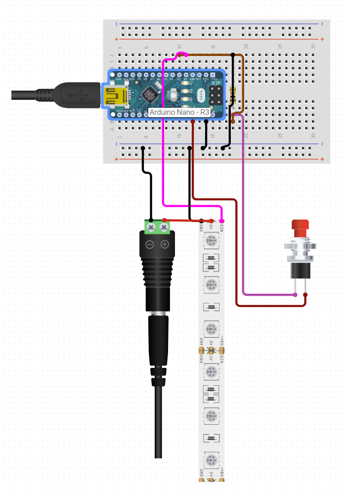

# PC_LED_Controller
Arduino based project to control LED strips in PC case

Note: if you're connecting usb and power at the same time then keep them separately!
Power button using arduino power and use external source only to power led.
Don't forget to connect grounds though.
Also, on schema D2 and D3 pins should be switched.
